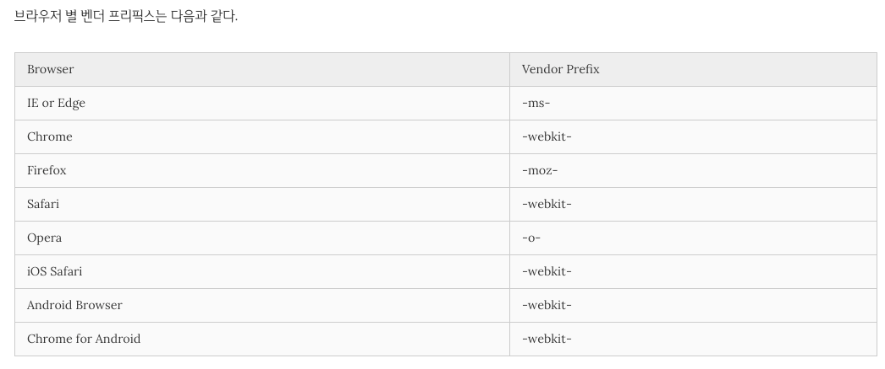
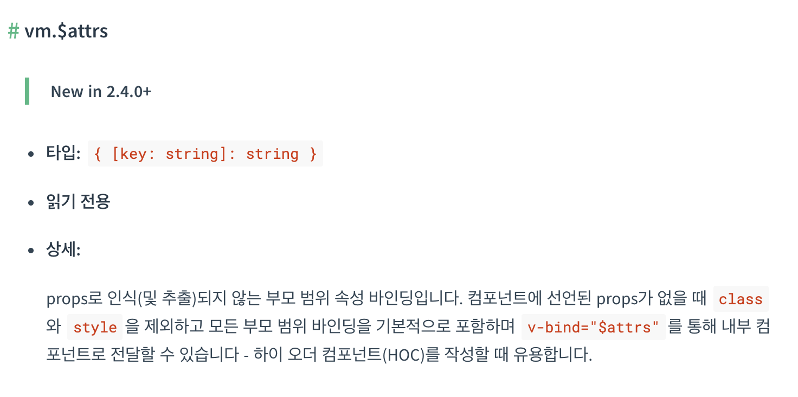

# 2주차

스터디 일: 2021년 11월 17일

>💡 발표 범위 : 클래스와 스타일 바인딩 [(튜토리얼 링크)](https://kr.vuejs.org/v2/guide/class-and-style.html), [(테스트 코드 링크)](https://codesandbox.io/s/keulraeseuwa-seutail-bainding-wgmom?file=/src/App.vue)

## 1. Class 바인딩

---

엘리먼트에 class attribute를 추가 할 때 사용

- **[공통]** v-bind (:bind) 디렉티브를 사용하여 클래스 바인딩
- **[공통]** 객체 구문, 배열 구문 사용 가능
- class attribute와 같이 사용 가능
- 컴포넌트에 class attribute로 추가 → 컴포넌트의 최상단 엘리먼트에 자동 추가

## 2. Style 바인딩 (inline-style css)

---

vue에서 사용하는 css inline-style

- **[공통]** v-bind (:bind) 디렉티브를 사용하여 클래스 바인딩
- **[공통]** 객체 구문, 배열 구문 사용 가능
  - key, value에 kebab-case, camelCase를 사용
  - vender-prefix 자동 부여 → 하지만 보통 scss를 사용하면 mixins를 사용하여 일괄 처리
    - vender-prefix란?
        
        CSS3 표준 확정되기 전의 실험적으로 제공하는 css 속성들은 브라우저마다 처리하는 알고리즘이 다르기 때문에 이에 맞춰 vender-prefix를 사용하여 css를 작성해야한다.
        
        브라우저 버전이 올라가면 사용하지 않는 경우도 생기지만, 보통 구형 브라우저를 지원하기위해 사용 할 필요가 있다.
        
        
        
        > 참고 링크
        1. [poiemaweb  css3-vender-prefix](https://poiemaweb.com/css3-vendor-prefix)
        2. [Can i use?](https://caniuse.com/)
        > 

## 3. 컴포넌트에 Attribute로 전달 시 주의점 (Class, Style바인딩 시 주의점)

---

- 컴포넌트에 attribute로 추가 시 → 컴포넌트의 최상단 엘리먼트에 자동 추가
- 최상단이 아닌, 지정된 위치에 attribute를 추가히고 싶을 때 → 컴포넌트에 inheritAttrs(false)를 추고 v-bind:$attr 사용
- 하지만 Class와 Style은 적용되지 않기 때문에, props로 전달해주어야함.

>❗ $attrs

[2주차 템플릿 문법](https://www.notion.so/2-f62c77a382684131b41529c4fe0dae51)