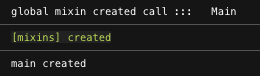
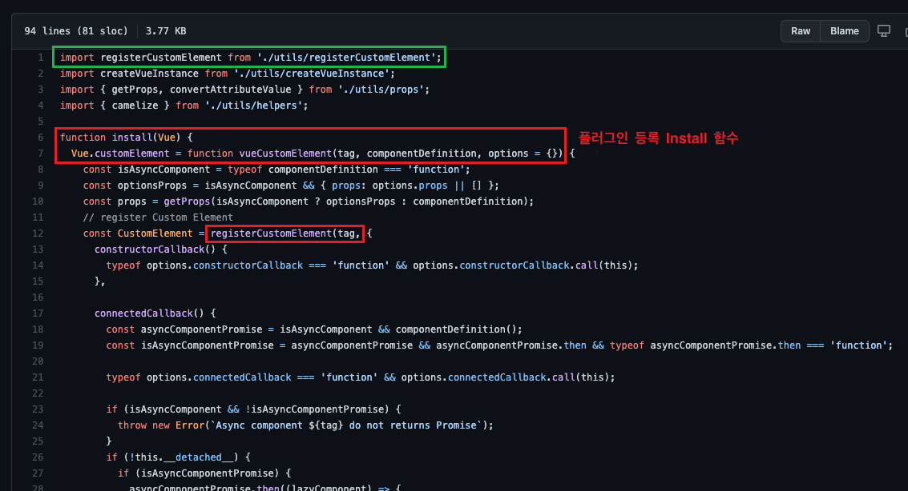
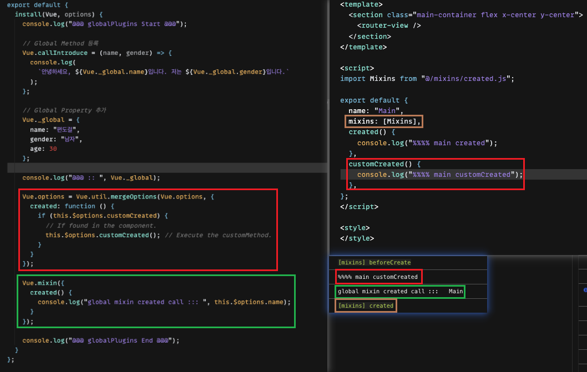

# 6주차 - 플러그인

&#9989; 발표 범위 : 플러그인  
&#9989; 발표자 : 편도걸  
&#9989; 스터디 일 : 2021년 12월 06일  

---

## 플러그인 [[CodeSendbox - Link]](https://codesandbox.io/s/peulreogeuin-teseuteu-mc1u2?file=/src/main.js)  
 Vue에서 자주 사용하는 메소드나, 라이브러리, 컴포넌트 등을 전역적으로 등록하여 사용 할 수 있게 도와주는 기능  

Vue 공식 튜토리얼에서는 5가지 유형으로 설명
1. 약간의 전역 메소드 또는 속성 추가
2. 하나 이상의 글로벌 에셋 추가
3. 글로벌 mixin으로 일부 컴포넌트 옵션 추가
4. Vue.prototype에 Vue인스턴스 메소드를 연결 > Vue 인스턴스 메소드 전역 사용
5. 가지고 있는 API를 제공하면서 동시에 일부 조합을 주입하는 라이브러리

> 사용법  
* 플러그인 등록   
  
  ```jsx
  // plugins/index.js

  const plugin = {
    // 플러그인으로 사용할 객체(Object)에 install 함수를 정의
      /* 
      * 매게변수로 Vue, options
      * Vue : 고정(필수)
      * options : 플러그인에 필요한 옵션값(선택)
      */
      install(Vue, options) {
        // 1. 전역 (메소드, 속성)
        Vue.globalMethod = () => {
            ...
        }
        Vue.globalProperties = {
            CONST: {
                WIDTH: 300,
                HEIGHT: 'auto',
                THEME: {
                    LIGHT: {...},
                    DARK: {...}
                }
            }
        }

        // 2. 전역 에셋 (디렉티브)
        Vue.directive('my-directive', {
            bind (el, binding, vnode, oldVnode) {
                ...
            }
            ...
        })

        // 3. 전역 컴포넌트 옵션 (믹스인) *특이사항1
        Vue.mixin({
            // 컴포넌트의 create보다 먼저 발생
            created() {
            // 필요한 로직 ...
            }
            ...
        })

        // 4. 인스턴스 메소드 추가
        Vue.prototype.$method = (options) => {
            // 필요한 로직 ...
        }
      }
  }

  export default plugin

  ```
* 플러그인 사용  
  
  ```jsx
  // main.js
  import Vue from "vue"
  import plugin from "./plugins"

  Vue.use(plugin)

  new Vue({
    render: (h) => h(App),
  }).$mount("#app");
  ```

* 특이사항  
  1. [전역 컴포넌트 옵션] 라이프 사이클은 플러그인 Mixin > 공통 mixin > 컴포넌트 순의 우선순위로 실행 됌
    
  2. module export를 사용하지 않고 `import Vue from "vue"`를 plugins/index.js파일 내에 선언한 후 Vue.use를 사용해도 됌

---
   
> ## 하지만, 튜토리얼의 내용에서 1번을 사용하는 이유를 딱히 찾을 수 없었음

### 약간의 전역 메소드 또는 속성 추가  
예제로 vue-custom-element를 들었는데, 코드를 간단히 확인해보니 WebComponent 생성 방식을 사용하여 Custom Tag로 컴포넌트를 만들어주는 라이브러리



[결론]
* 컴포넌트 내에서 사용하는 것이 아닌 main.js와 같은 js단위에서 사용
* prototype이 있기 때문에 Vue인스턴스 내에서는 사용 할 일이 없을 듯

---

## **정리**
플러그인은 자주 사용하는 메소드나, 라이브러리를 전역적으로 선언하여 `this`를 통해 컴포넌트 내에서 자유롭게 사용 할 때 자주 사용 하는 것 같다.

여러 활용할 방안을 생각해보았는데, vue-router의 beforeEnter처럼 page component를 호출하기전에 실행되는것처럼 custom life cycle을 만들 수 있는 경우를 발견하여 해당 코드를 조금 더 발전시켜보면 활용할 부분이 생기지 않을까 생각한다.

